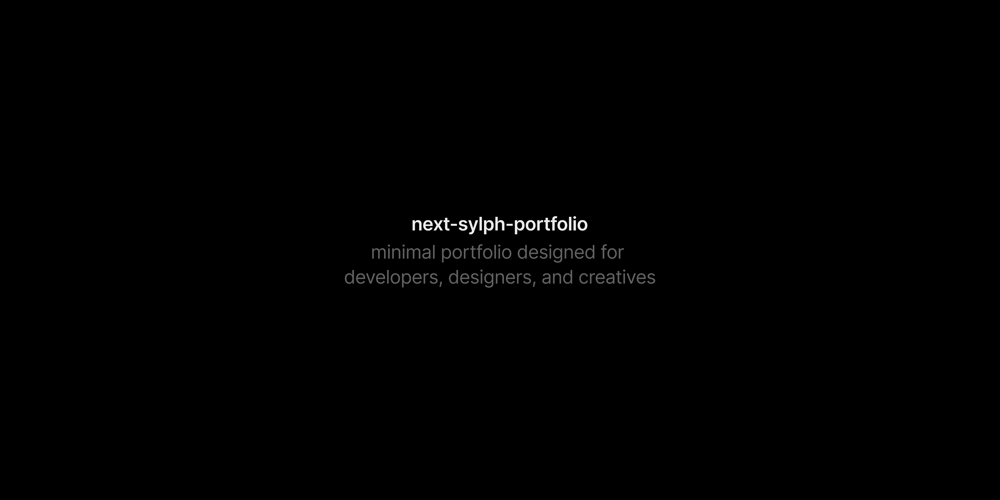

    
    

A minimal and lightweight portfolio template designed for developers, designers, and creatives. It offers a clean, modern interface to showcase your work, share your ideas, and write blog posts. 
Built using Next.js, Sylph is optimized for performance and developer experience, providing flexibility and ease of use whether you're showcasing projects or writing content.

## Features

- **Responsive Design**: Works seamlessly on all devices and browsers.
- **MDX and Markdown Support**: Write posts using MDX or Markdown, with extensive flexibility.
- **Optimized for SEO**: Includes sitemaps, robots.txt, and metadata for better search engine visibility.
- **Dynamic OpenGraph (OG) Images**: Automatically generate OG images for social media sharing.
- **Syntax Highlighting**: Built-in support for highlighting code blocks.
- **Tailwind v4**: Fully configured with the latest version of Tailwind CSS for efficient styling.
- **Automated Blog Time Dating**: Automatically manage post creation and updated timestamps.
- **Extensive Frontmatter**: Customize posts with rich metadata and organizational fields.
- **Clean and Simple Structure**: Easy-to-navigate codebase for efficient customization.
- **Light and Dark Mode**: Simple theming with light/dark mode toggle support.
- **Foundations for Expansion**: Built with flexibility in mind, allowing easy expansion and customization.
- **Theming**: Easily extend or customize themes to suit your brand.

## Documentation

To get started with Sylph, check out the [Guides](https://next-sylph-portfolio.vercel.app/guides).

## Sponsor 

If you find this project helpful, consider supporting the project. Your contribution helps maintain the project and supports future development.
